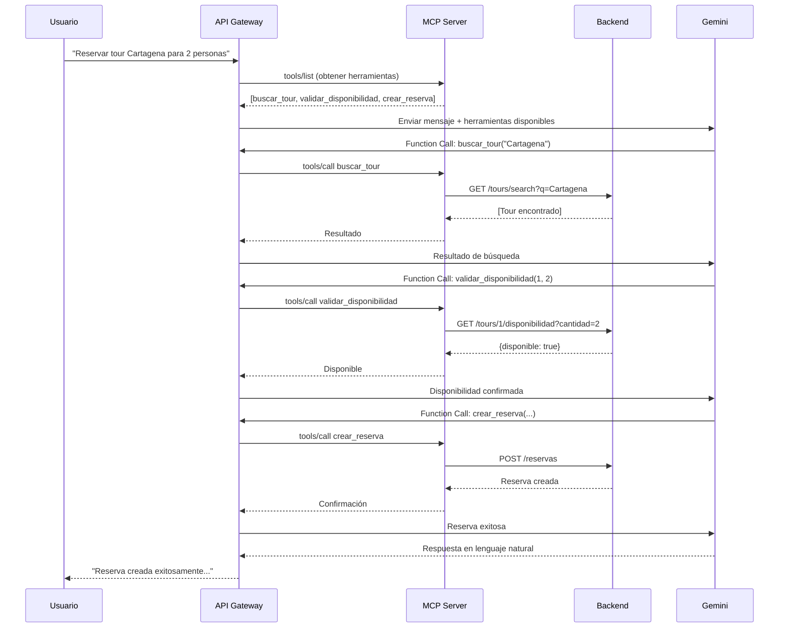

# Proyecto MCP - Sistema de Tours y Reservas con IA

**Universidad Laica Eloy Alfaro de Manabí**  
**Facultad de Ciencias Informáticas**  
**Carrera de Software - Taller 3**

Sistema de gestión de tours turísticos y reservas integrado con Model Context Protocol (MCP) y Gemini AI, que permite a la inteligencia artificial orquestar servicios de manera inteligente.

---

## 🏗️ Arquitectura del Sistema

El proyecto implementa una arquitectura de 3 capas:

```
┌─────────────┐
│   Usuario   │
└──────┬──────┘
       │ Lenguaje Natural
       ▼
┌─────────────────────────────────────┐
│      API Gateway (Puerto 3000)      │
│  - NestJS                           │
│  - Gemini 2.0 Flash                 │
│  - Function Calling                 │
└──────┬──────────────────────────────┘
       │ JSON-RPC 2.0
       ▼
┌─────────────────────────────────────┐
│    MCP Server (Puerto 3001)         │
│  - Express + TypeScript             │
│  - 3 Tools (Búsqueda, Validación,  │
│    Creación de Reservas)            │
└──────┬──────────────────────────────┘
       │ REST API
       ▼
┌─────────────────────────────────────┐
│      Backend (Puerto 3002)          │
│  - NestJS + TypeORM                 │
│  - SQLite Database                  │
│  - Entidades: Tours, Reservas       │
└─────────────────────────────────────┘
```

---

## 📦 Estructura del Proyecto

```
proyecto-mcp/
├── apps/
│   ├── backend/              # Microservicio REST (NestJS)
│   │   ├── src/
│   │   │   ├── tour/         # Módulo de Tours
│   │   │   ├── reserva/      # Módulo de Reservas
│   │   │   ├── app.module.ts
│   │   │   └── main.ts
│   │   ├── data/             # Base de datos SQLite
│   │   └── package.json
│   │
│   ├── mcp-server/           # Servidor MCP (Express)
│   │   ├── src/
│   │   │   ├── tools/        # Definición de Tools
│   │   │   │   ├── buscar-tour.tool.ts
│   │   │   │   ├── validar-disponibilidad.tool.ts
│   │   │   │   ├── crear-reserva.tool.ts
│   │   │   │   ├── registry.ts
│   │   │   │   └── types.ts
│   │   │   ├── services/
│   │   │   │   └── backend-client.ts
│   │   │   └── server.ts
│   │   └── package.json
│   │
│   └── api-gateway/          # Gateway con Gemini (NestJS)
│       ├── src/
│       │   ├── gemini/       # Integración Gemini AI
│       │   ├── mcp-client/   # Cliente JSON-RPC
│       │   ├── chat/         # Controlador principal
│       │   ├── app.module.ts
│       │   └── main.ts
│       └── package.json
│
├── docs/                     # Documentación adicional
│   ├── EJEMPLOS.md
│   ├── PRUEBAS.md
│   └── ARQUITECTURA.md
│
└── README.md
```

---

## 🚀 Instalación y Configuración

### Prerrequisitos

- Node.js 20+
- npm 10+
- Cuenta de Google (para obtener API Key de Gemini)

### Paso 1: Clonar e instalar dependencias

```bash
cd Parcial2/Practica3/proyecto-mcp

# Instalar dependencias de cada componente
cd apps/backend
npm install

cd ../mcp-server
npm install

cd ../api-gateway
npm install
```

### Paso 2: Configurar Gemini API Key

1. Ir a [Google AI Studio](https://aistudio.google.com/app/apikey)
2. Crear una API Key gratuita
3. Copiar el archivo `.env.example` a `.env` en `api-gateway`:

```bash
cd apps/api-gateway
cp .env.example .env
```

4. Editar `.env` y agregar tu API Key:

```env
PORT=3000
MCP_SERVER_URL=http://localhost:3001
GEMINI_API_KEY=TU_API_KEY_AQUI
```

### Paso 3: Iniciar los servicios

**Opción A: Manual (en 3 terminales separadas)**

Terminal 1 - Backend:
```bash
cd apps/backend
npm run start:dev
```

Terminal 2 - MCP Server:
```bash
cd apps/mcp-server
npm run dev
```

Terminal 3 - API Gateway:
```bash
cd apps/api-gateway
npm run start:dev
```

**Opción B: Usando un script** (crear en la raíz del proyecto):

```bash
# start-all.ps1 (PowerShell)
Start-Process pwsh -ArgumentList "-NoExit", "-Command", "cd apps/backend; npm run start:dev"
Start-Process pwsh -ArgumentList "-NoExit", "-Command", "cd apps/mcp-server; npm run dev"
Start-Process pwsh -ArgumentList "-NoExit", "-Command", "cd apps/api-gateway; npm run start:dev"
```

---

## 🧪 Pruebas y Ejemplos

### 1. Verificar que los servicios estén activos

```bash
# Backend
curl http://localhost:3002/tours

# MCP Server
curl http://localhost:3001/health

# API Gateway
curl http://localhost:3000/chat/health
```

### 2. Insertar datos de prueba en el Backend

```bash
# Crear un tour
curl -X POST http://localhost:3002/tours \
  -H "Content-Type: application/json" \
  -d '{
    "nombre": "Tour Cartagena Colonial",
    "destino": "Cartagena de Indias",
    "precio": 450.00,
    "cuposTotales": 20,
    "fechaSalida": "2026-02-15",
    "fechaRetorno": "2026-02-20"
  }'

# Crear otro tour
curl -X POST http://localhost:3002/tours \
  -H "Content-Type: application/json" \
  -d '{
    "nombre": "Aventura Amazónica",
    "destino": "Leticia - Amazonas",
    "precio": 850.00,
    "cuposTotales": 15,
    "fechaSalida": "2026-03-10",
    "fechaRetorno": "2026-03-17"
  }'
```

### 3. Probar la IA con lenguaje natural

**Ejemplo 1: Búsqueda simple**
```bash
curl -X POST http://localhost:3000/chat \
  -H "Content-Type: application/json" \
  -d '{
    "message": "Busca tours a Cartagena"
  }'
```

**Respuesta esperada:**
```json
{
  "userPrompt": "Busca tours a Cartagena",
  "response": "Encontré el Tour Cartagena Colonial, con destino a Cartagena de Indias. Tiene un precio de $450.00, con 20 cupos disponibles. Las fechas son del 15 al 20 de febrero de 2026.",
  "toolsExecuted": [
    {
      "tool": "buscar_tour",
      "arguments": { "query": "Cartagena" },
      "result": { "success": true, "data": [...] }
    }
  ],
  "iterations": 1
}
```

**Ejemplo 2: Flujo completo (búsqueda + validación + reserva)**
```bash
curl -X POST http://localhost:3000/chat \
  -H "Content-Type: application/json" \
  -d '{
    "message": "Quiero reservar el tour a Cartagena para 3 personas. Mi nombre es Juan Pérez, email juan@email.com, teléfono 3001234567"
  }'
```

**La IA ejecutará automáticamente:**
1. `buscar_tour` → Encuentra el tour de Cartagena
2. `validar_disponibilidad` → Verifica que hay 3 cupos
3. `crear_reserva` → Crea la reserva con los datos proporcionados

---

## 🛠️ Tools Implementados

### Tool 1: buscar_tour
**Descripción:** Busca tours por nombre o destino  
**Parámetros:**
- `query` (string): Término de búsqueda

**Ejemplo:**
```json
{
  "name": "buscar_tour",
  "arguments": { "query": "Cartagena" }
}
```

### Tool 2: validar_disponibilidad
**Descripción:** Valida si un tour tiene cupos disponibles  
**Parámetros:**
- `tourId` (number): ID del tour
- `numeroPasajeros` (number): Cantidad de pasajeros

**Ejemplo:**
```json
{
  "name": "validar_disponibilidad",
  "arguments": { "tourId": 1, "numeroPasajeros": 3 }
}
```

### Tool 3: crear_reserva
**Descripción:** Crea una nueva reserva  
**Parámetros:**
- `tourId` (number): ID del tour
- `nombreCliente` (string): Nombre completo
- `emailCliente` (string): Email
- `telefonoCliente` (string): Teléfono
- `numeroPasajeros` (number): Cantidad de pasajeros

**Ejemplo:**
```json
{
  "name": "crear_reserva",
  "arguments": {
    "tourId": 1,
    "nombreCliente": "Juan Pérez",
    "emailCliente": "juan@email.com",
    "telefonoCliente": "3001234567",
    "numeroPasajeros": 3
  }
}
```

---

## 📊 Modelo de Datos

### Entidad: Tour
```typescript
{
  id: number;
  nombre: string;
  destino: string;
  precio: number;
  cuposDisponibles: number;
  cuposTotales: number;
  fechaSalida: Date;
  fechaRetorno: Date;
  activo: boolean;
}
```

### Entidad: Reserva
```typescript
{
  id: number;
  tourId: number;
  nombreCliente: string;
  emailCliente: string;
  telefonoCliente: string;
  numeroPasajeros: number;
  montoTotal: number;
  estado: 'PENDIENTE' | 'CONFIRMADA' | 'CANCELADA';
  creadoEn: Date;
  confirmadoEn?: Date;
}
```

---

## 🔧 Tecnologías Utilizadas

| Componente | Tecnologías |
|------------|-------------|
| Backend | NestJS, TypeORM, SQLite, class-validator |
| MCP Server | TypeScript, Express, Axios |
| API Gateway | NestJS, @google/generative-ai |
| IA | Gemini 2.0 Flash (Function Calling) |
| Protocolo | JSON-RPC 2.0 |

---

## 🎯 Flujo de Ejecución Completo



---

## 📝 Endpoints Disponibles

### Backend (Puerto 3002)
- `GET /tours` - Listar tours activos
- `GET /tours/search?q=query` - Buscar tours
- `GET /tours/:id` - Obtener un tour
- `POST /tours` - Crear tour
- `GET /tours/:id/disponibilidad?cantidad=N` - Verificar disponibilidad
- `POST /reservas` - Crear reserva
- `GET /reservas` - Listar reservas
- `POST /reservas/:id/confirmar` - Confirmar reserva

### MCP Server (Puerto 3001)
- `POST /mcp` - Endpoint JSON-RPC 2.0
- `GET /health` - Estado del servidor
- `GET /` - Documentación de la API

### API Gateway (Puerto 3000)
- `POST /chat` - Enviar mensaje a la IA
- `GET /chat/tools` - Listar herramientas disponibles
- `GET /chat/health` - Verificar conexión con MCP

---

## 🎓 Objetivos de Aprendizaje Cumplidos

✅ **Comprender MCP:** Implementación completa del protocolo  
✅ **Diseñar Tools:** 3 Tools con JSON Schema correcto  
✅ **Implementar JSON-RPC 2.0:** Servidor funcional con especificación completa  
✅ **Integrar Gemini:** Function Calling operativo  
✅ **Reutilizar código:** Microservicio backend integrado  

---

## 🐛 Solución de Problemas

### Error: "GEMINI_API_KEY no está configurada"
**Solución:** Crear archivo `.env` en `api-gateway` con tu API Key

### Error: "Cannot connect to MCP Server"
**Solución:** Verificar que el MCP Server esté ejecutándose en el puerto 3001

### Error: "Tour con ID X no encontrado"
**Solución:** Insertar datos de prueba en el backend primero

### Base de datos vacía
**Solución:** Ejecutar los scripts de creación de tours en la sección de pruebas

---

## 👥 Autores

**Grupo:** [Nombre del grupo]  
**Integrantes:**
- [Estudiante 1]
- [Estudiante 2]
- [Estudiante 3]

**Docente:** Ing. John Cevallos  
**Período:** 2025-2026 (2)  
**Asignatura:** Aplicación para el Servidor Web

---

## 📄 Licencia

Este proyecto es material académico de la ULEAM.

---

## 📚 Referencias

- [Model Context Protocol](https://modelcontextprotocol.io)
- [Gemini AI](https://ai.google.dev/gemini-api/docs)
- [JSON-RPC 2.0 Specification](https://www.jsonrpc.org/specification)
- [NestJS Documentation](https://docs.nestjs.com/)
- [TypeORM Documentation](https://typeorm.io/)
